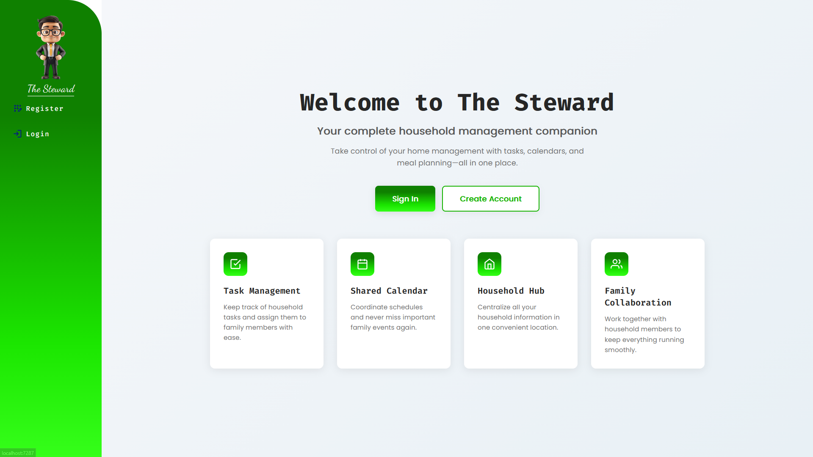
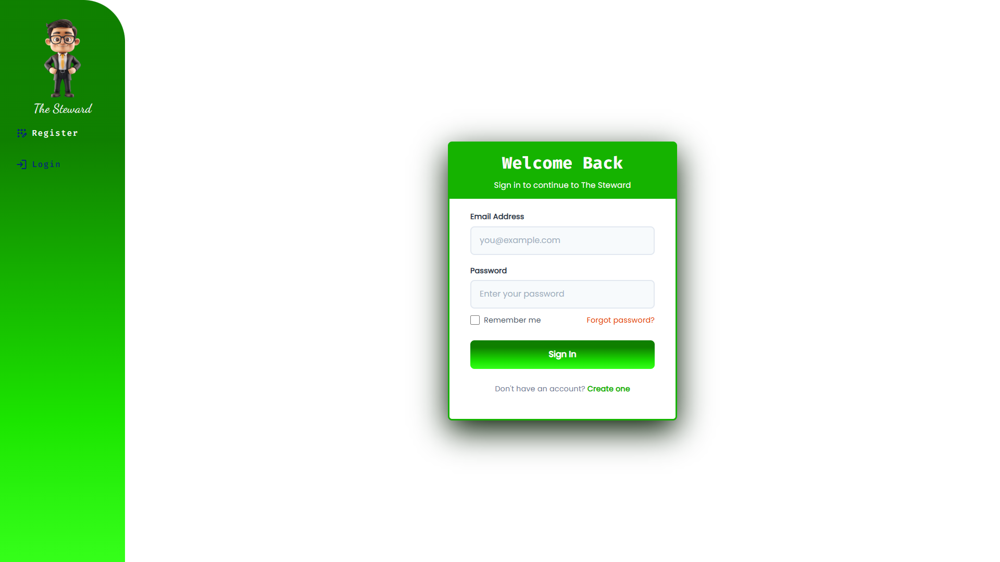
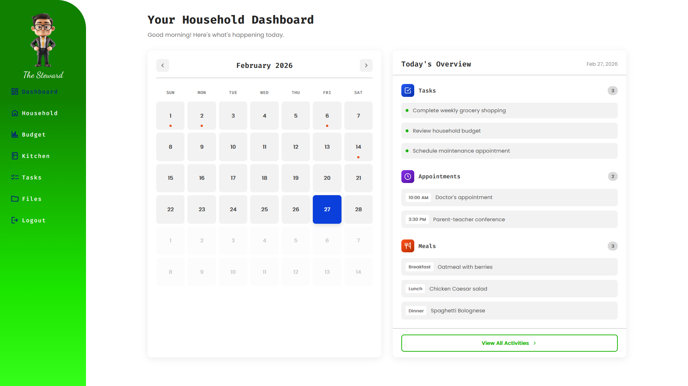
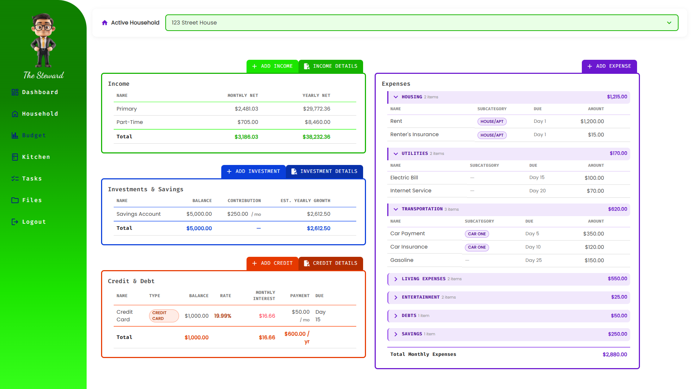
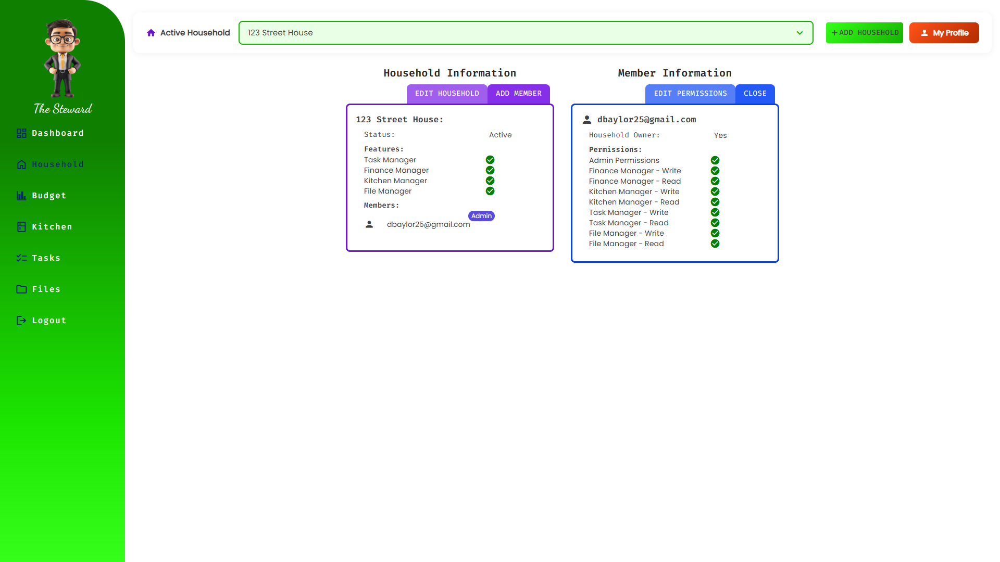

# 🏠 The Steward

> A collaborative home management system for budgeting, meal planning, and chore organization.

---

## Overview

The Steward is a multi-user household management application designed to help households stay organized and financially aware. It brings together budget tracking, meal planning, and chore management into a single shared workspace — with secure, role-based access so every member of a household sees the right information.

---

## ✨ Features

- **Finance Manager** — Track income, investments, credit & debt, and expenses with category grouping and live tax estimates
- **Household Management** — Create and manage households, invite members, and assign roles and permissions
- **Meal Planning** *(coming soon)* — Plan weekly meals collaboratively across your household
- **Chore Tracking** *(coming soon)* — Assign and manage recurring household tasks

---

## 📸 Screenshots

### Landing Page


---
### Login Page


---
### User Dashboard


---

### Budget Dashboard


---

### Household Management


---

## 🛠 Tech Stack

| Layer | Technology |
|---|---|
| Frontend | Blazor Server |
| Backend | .NET 10 / ASP.NET Core |
| ORM | Entity Framework Core |
| Database | PostgreSQL |
| UI Components | MudBlazor |
| Authentication | ASP.NET Core Identity |

---

## 🚀 Getting Started

### Prerequisites

- [.NET 10 SDK](https://dotnet.microsoft.com/download)
- [PostgreSQL](https://www.postgresql.org/download/)

### Setup

**1. Clone the repository**
```bash
git clone https://github.com/your-username/the-steward.git
cd the-steward
```

**2. Configure the database connection**

Copy the example settings and fill in your PostgreSQL credentials:
```bash
cp appsettings.Example.json appsettings.Development.json
```

```json
{
  "ConnectionStrings": {
    "DefaultConnection": "Host=localhost;Database=thesteward;Username=your_user;Password=your_password"
  }
}
```

**3. Apply database migrations**
```bash
dotnet ef database update
```

**4. Run the application**
```bash
dotnet run
```

The app will be available at `https://localhost:5001`.

---

## 🏗 Project Structure

```
TheSteward/
├── TheSteward.Core/              # Domain models, DTOs, interfaces
│   ├── Models/
│   ├── Dtos/
│   └── IServices/
├── TheSteward.Infrastructure/    # EF Core, service implementations
│   ├── Data/
│   ├── Repositories/
│   └── Services/
└── TheSteward.Shared/            # Blazor components, pages, state
    ├── Components/
    │   └── FinanceComponents/
    ├── Pages/
    └── Dtos/
```

---

## 🔐 Authentication & Permissions

The Steward uses ASP.NET Core Identity for authentication. Within each household, members are assigned roles that control read and write access to features like the Finance Manager.

---

## 🗺 Roadmap

- [x] Household creation and member management
- [x] Finance Manager — Income, Investments, Credit, Expenses
- [ ] Meal planning module
- [ ] Chore tracking module
- [ ] Deployment (self-hosted / cloud)
- [ ] Mobile-responsive improvements

---

## 🤝 Contributing

This project is currently in active development. If you'd like to contribute, feel free to open an issue or submit a pull request.
